# 🏦 KB 키즈뱅크

> 2023 KB IT's Your Life 4기 최종 프로젝트 
> 부모가 자녀의 금융학습에 적극적으로 참여하는 가족 금융교육플랫폼
>  

# 📌 Project & Members

> 진행기간: 2023. 08.25 ~ 2023. 09. 22 (4주)

### 프로젝트 소개

IT's your life 4기, 부모와 은행이 아이의 금융학습을 위한 미션/챌린지/퀴즈를 주고, 아이는 미션을 달성하면 리워드를 받을 수 있는 **키즈 금융교육 사이트**가 있다면 어떨까?

- 부모님이 시킨 심부름을 하면 1000원 리워드, 미션에 도전해보자!

- 은행방문만 해도 은행과 부모리워드가, 챌린지를 참여해보자!

- 퀴즈 정답을 잘 모르겠어? AI인 KB 곰에게 질문해보자!

- 우리아이의 저축과 소비내역이 궁금하다면, 소비통계를 확인해보자!

- 부모와 은행의 리워드 선택으로 아이의 만족도 증가, 금융상품을 살펴보자!

🔗 [전체 기능 시연 영상 바로가기](https://youtu.be/RlX1zvvLQxc)

 

### 기술스택

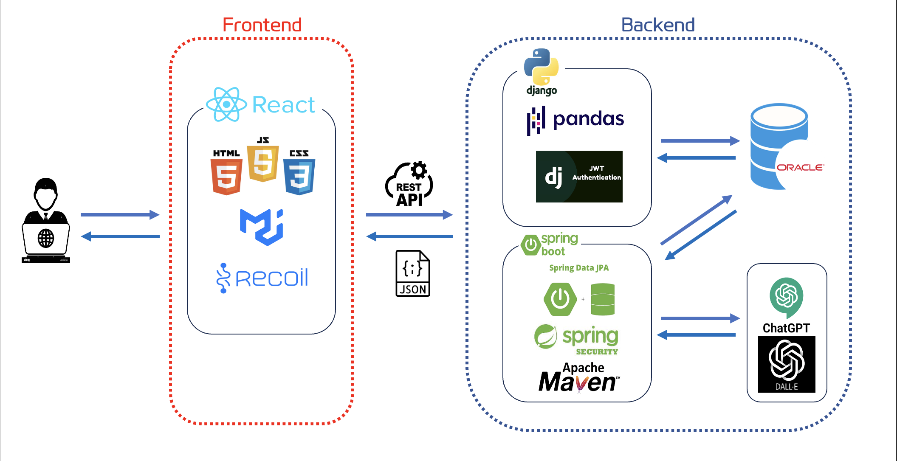

### 서버 아키텍처

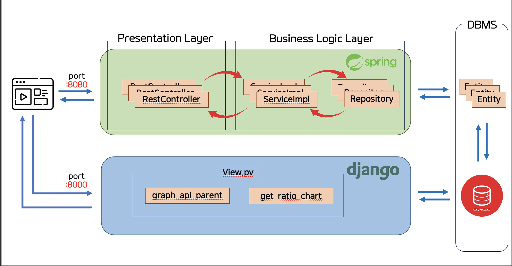

 

### 프로젝트 멤버

<table>
    <tr>
        <td align="center">
	    <a href="https://github.com/KSEOP">
	    	
	    	 
	    	
	    	<b>강태섭</b>
	    	 
	    	
	        
	    </a>
	     
	</td>
        <td align="center">
	    <a href="https://github.com/mellykim123">
	    	
	    	 
	    	
	    	<b>김지은</b>
	    	 
	    	
	        
	    </a>
	     
	</td>
        <td align="center">
	    <a href="https://github.com/rlagkswn00">
	    	
	    	 
	    	
	    	<b>김한주</b>
	    	 
	    	
	        
	    </a>
	     
	</td>
	<td align="center">
	    <a href="https://github.com/yoondain">
	    	
	    	 
	    	
	    	<b>윤다인</b>
	    	 
	    	
	        
	    </a>
	     
	</td>
	<td align="center">
	    <a href="https://avatars.githubusercontent.com/u/96781855?v=4">
	    	
	    	 
	    	
	    	<b>최송희</b>
	    	 
	    	
	        
	    </a>
	     
	</td>
  	<td align="center">
	    <a href="https://github.com/ChoiYoo">
	    	
	    	 
	    	
	    	<b>최유정</b>
	    	 
	    	
	        
	    </a>
	     
	</td>
    </tr>
</table>
 

# 🤝 협업툴

 

# ⚙️ 기술 스택

### **Environment**

### **Front-End**

### **Back-End**

### **API**

 

# 🗒️ 기능 소개

### 0. 로그인/회원가입

- KB키즈뱅크는 로그인 후 기능 사용 가능(회원제)
- 회원가입 시, 이메일 중복 여부 체크 

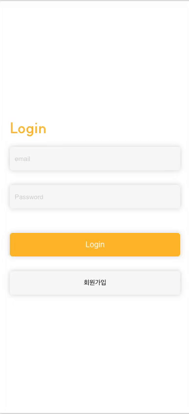

### 1. 메인화면

- (부모) 계좌연동, 자녀금융관리, 자녀금융상품 조회, 미션/챌린지 관리  
- (자녀) 일일퀴즈, 보상금저장소, 미션목록, 챌린지목록  

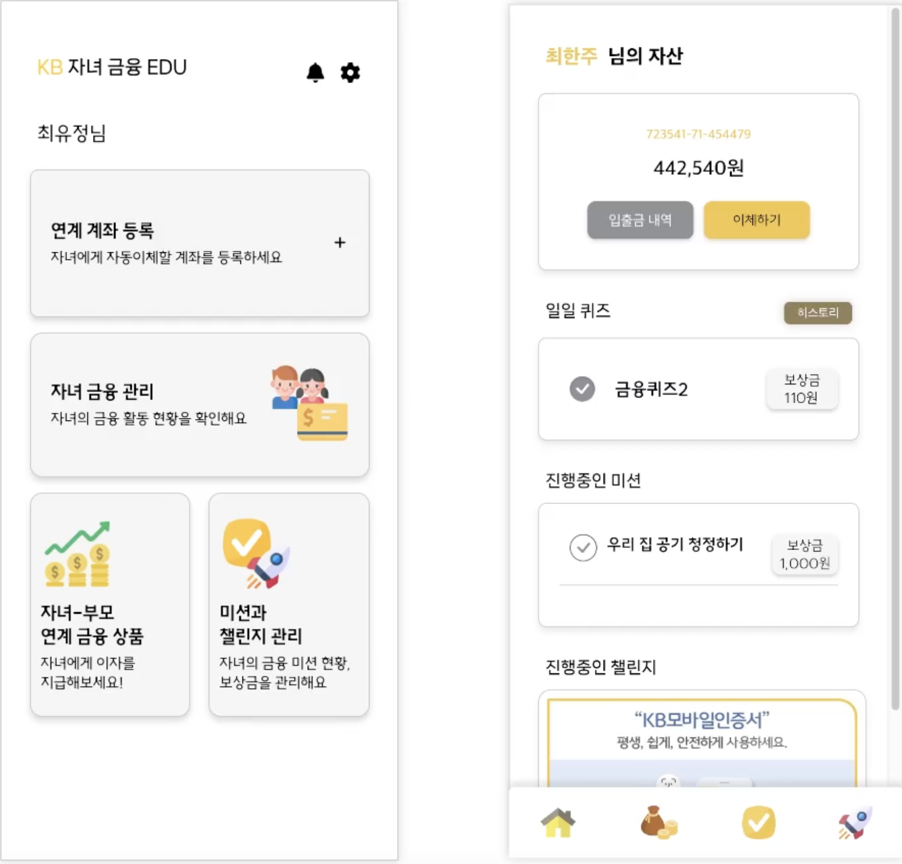
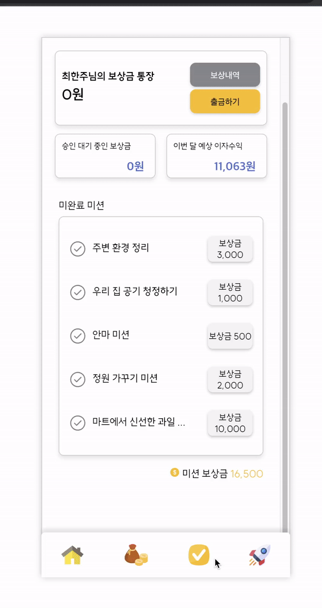

### 2. 자녀금융관리

- 원하는 자녀를 선택후 바로 송금 가능
- 자녀 소비통계 확인  

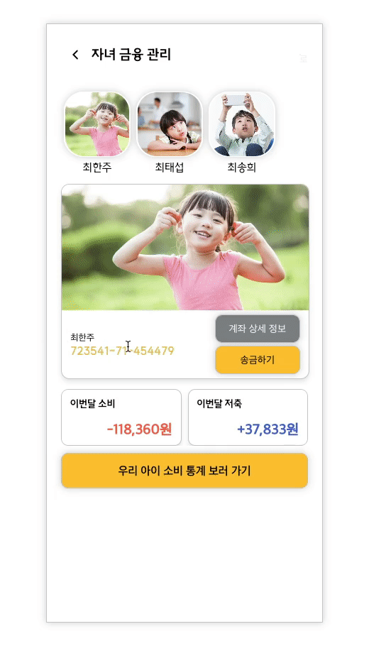
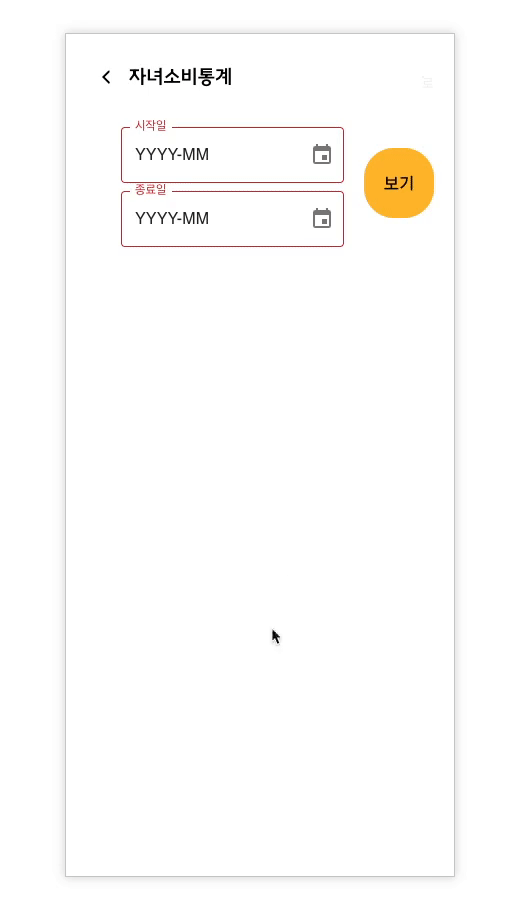

### 3. 상품조회

- 은행과 부모의 리워드 상세설정
- 퀴즈/미션/챌린지 성공하면, 리워드 지급 

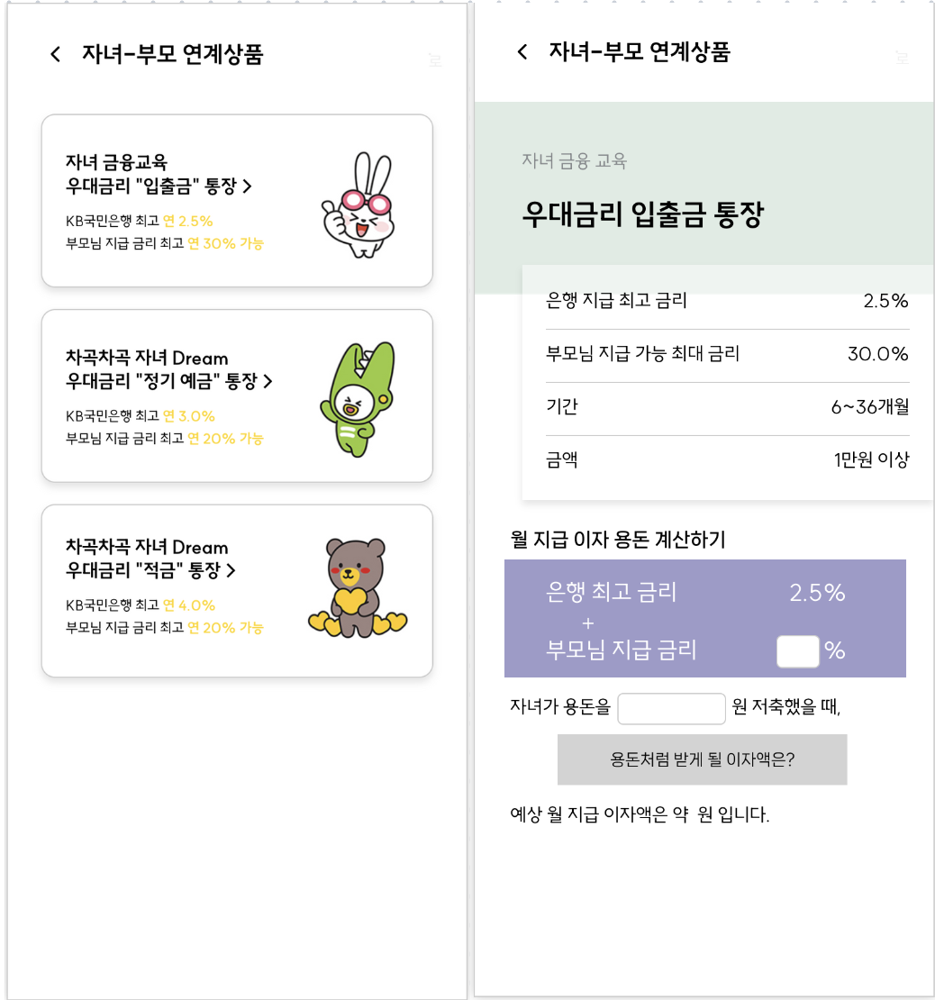

### 4. 미션

- 미션 추가, 삭제, 수정 가능
- 미션이 떠오르지 않을때는 미션 추천하는 AI기능 이용
- 미션 전체/진행중/요청 별로 필터링가능 
  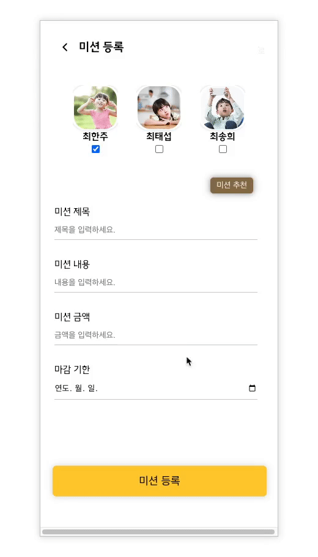
  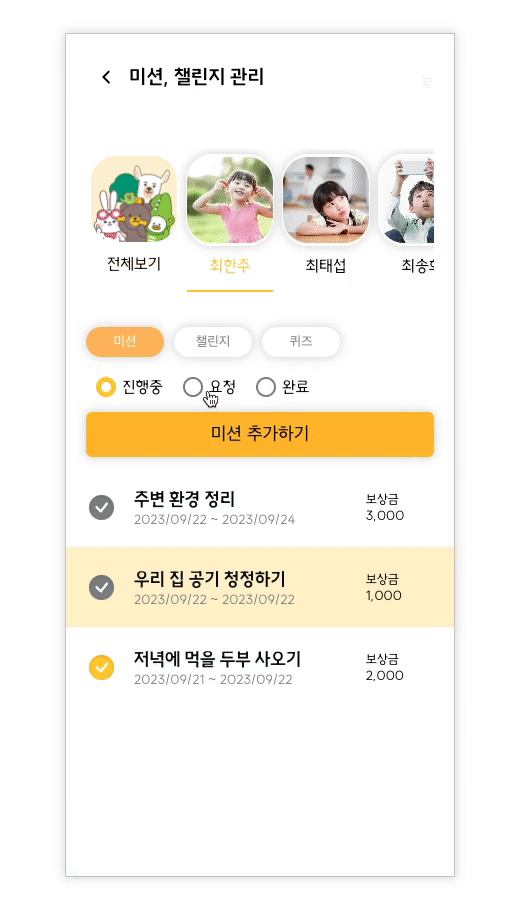

### 5. 챌린지

- 부모가 자녀에게 챌린지 추천, 자녀가 부모에게 챌린지 요청가능
- 부모가 은행 리워드에 부모 리워드 추가 가능
- 챌린지 전체/추천/진행중/요청 별로 필터링 가능 

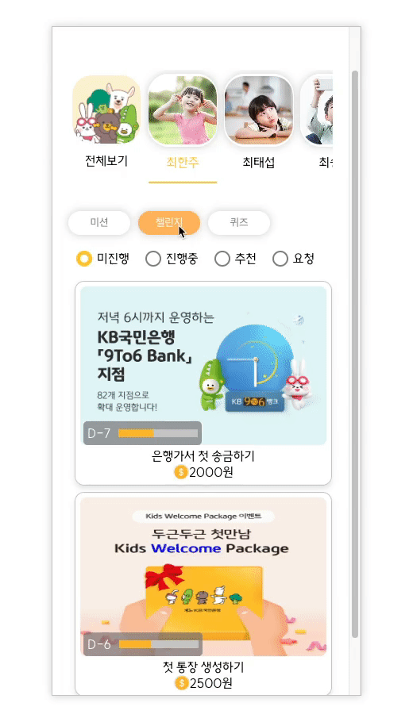

### 6. 퀴즈

- AI KB곰에게 퀴즈 문제 질문 가능
- 퀴즈 히스토리에서 그동안 푼 문제 확인가능 

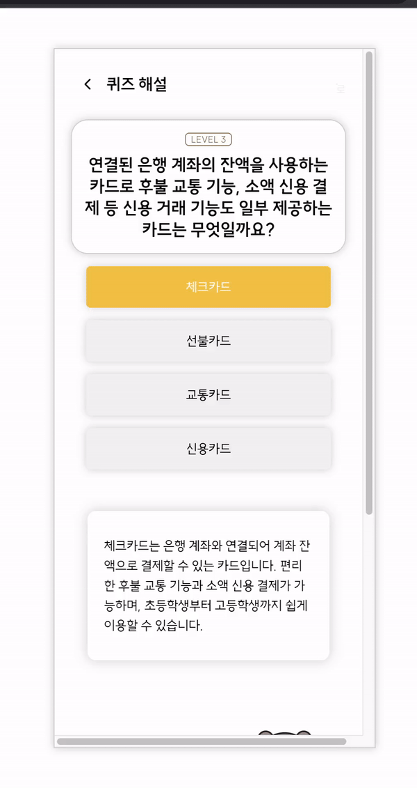

### 7. 보상금

- 모은 보상금은 바로 현금처럼 출금가능 
  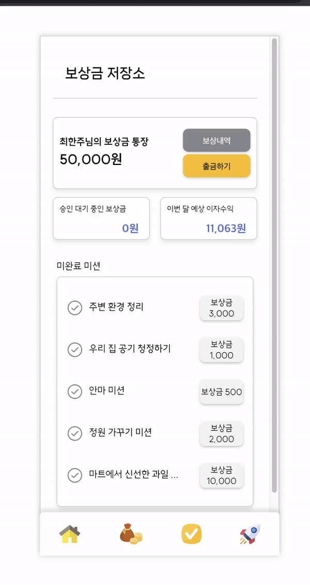

# ⚒️ 주요 기술력 소개

### JWT(Json Web Token)

- Client가 Server로 로그인 요청을 보내면 Client에게 JWT 토큰을 발급.  
- 만약 Client가 API를 통해 접근하게 되면 JWT토큰을 함께 전달하며, Server가 토큰을 검증한 후 Client에게 응답을 전송.   
  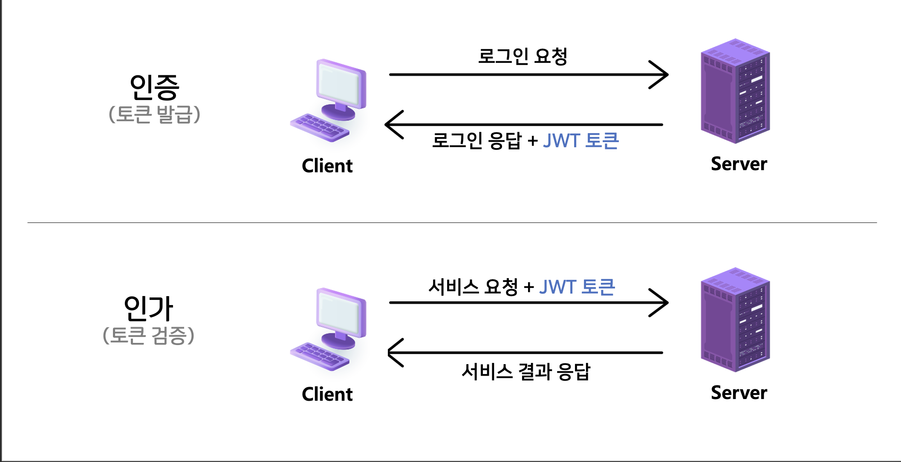
     

### OpenAI - GPT-3.5

- 유저가 퀴즈해설을 검색하면 우선 DB로 접근하여 해당 해설이 DB에 있는지 유무를 판단.  
- 만약 DB에 존재한다면, 사용자에게 해설을 전송. 만약 존재하지 않는다면, ChatGPT에 해설의 의미를 요청.   
  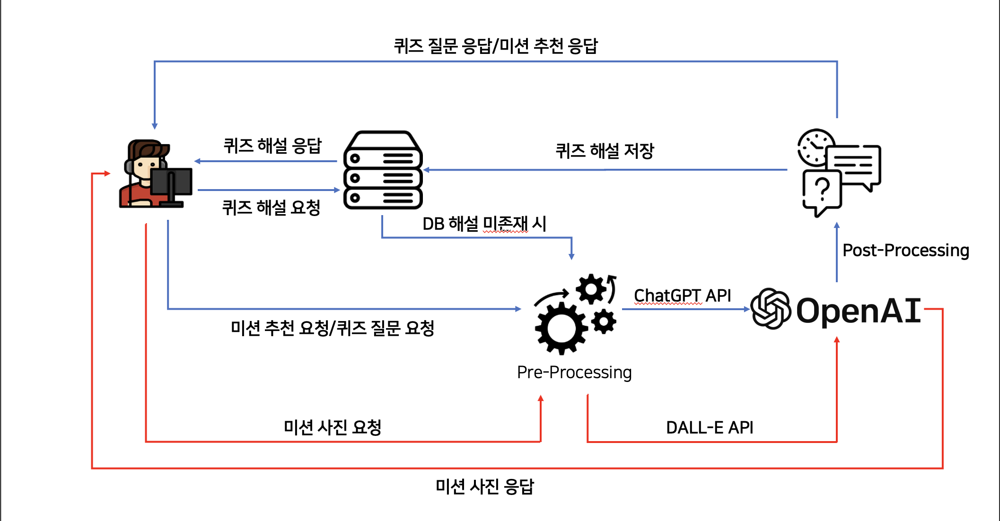
     
